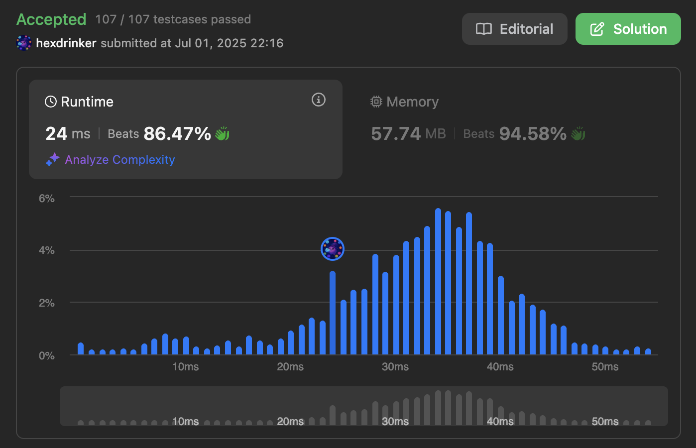

## 🧑‍💻 언어 및 제출 결과

- 사용 언어: `JavaScript`, `Python`, `TypeScript`, ...
- 통과 여부: ✅ / ❌

## 🧠 풀이 설명

- `Map`을 활용해 순회 중 target에서 현재 값을 뺀 값을 빠르게 탐색했습니다.
- 반복문을 한 번만 돌면서 O(n)으로 해결했습니다.

## 📊 시간/공간 복잡도

> ✅ 어떠한 근거로 시간/공간 복잡도가 이렇게 나왔는지 설명해주세요.

> ⚡️ 풀이의 속도와 메모리 등을 캡쳐해서 올려주세요.

- 시간 복잡도: `O(n)`
- 공간 복잡도: `O(1)`

## 📝 추가 설명 (선택)

- 고민했던 포인트가 있다면 간단히 적어주세요.

## 🙋‍♂️ 리뷰어에게

- 리뷰어가 보면 좋을 포인트, 질문, 궁금한 점 등을 작성해 주세요.
